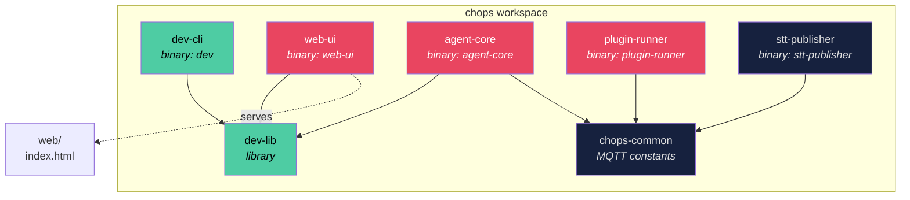
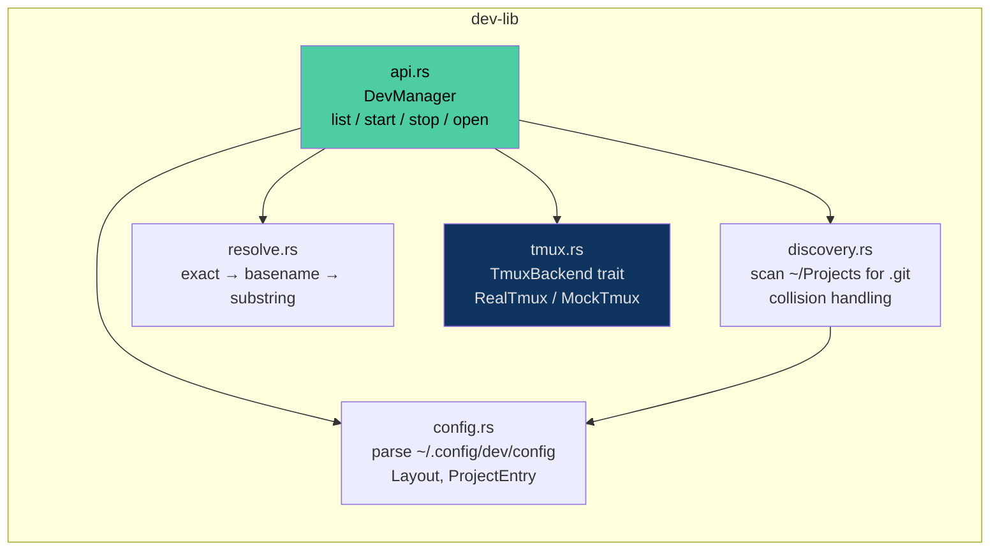
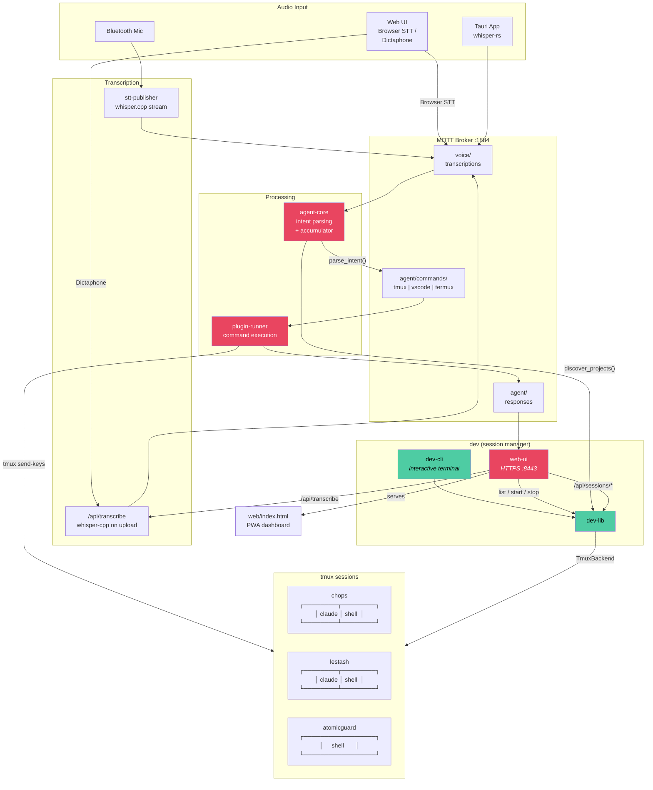
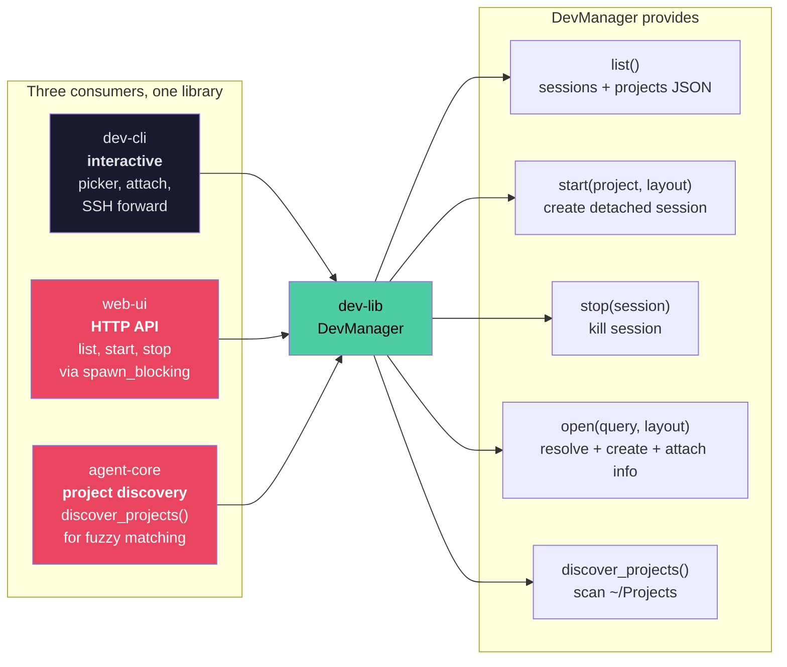
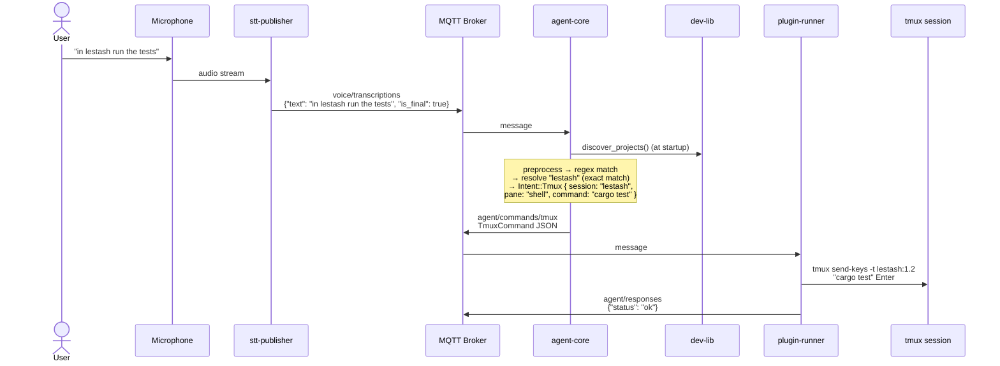
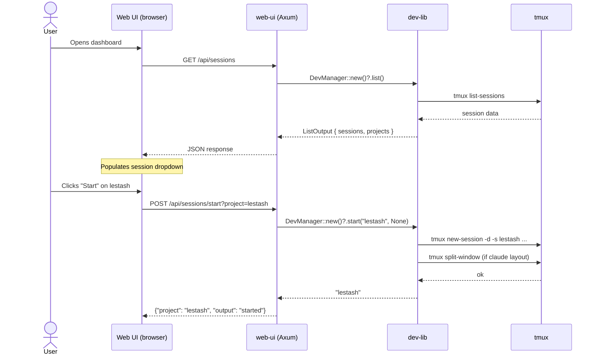
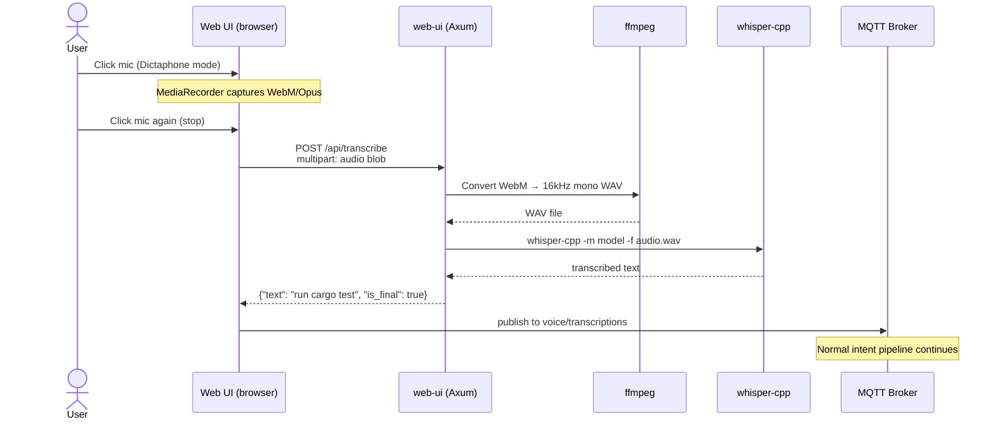

# dev — Architecture & Integration

## Crate Dependency Graph

## dev-lib Internal Structure

## System Integration

## dev-lib Consumer Patterns

## Voice Command Flow (end-to-end)

## Web UI Session Management Flow

## Dictaphone Transcription Flow

