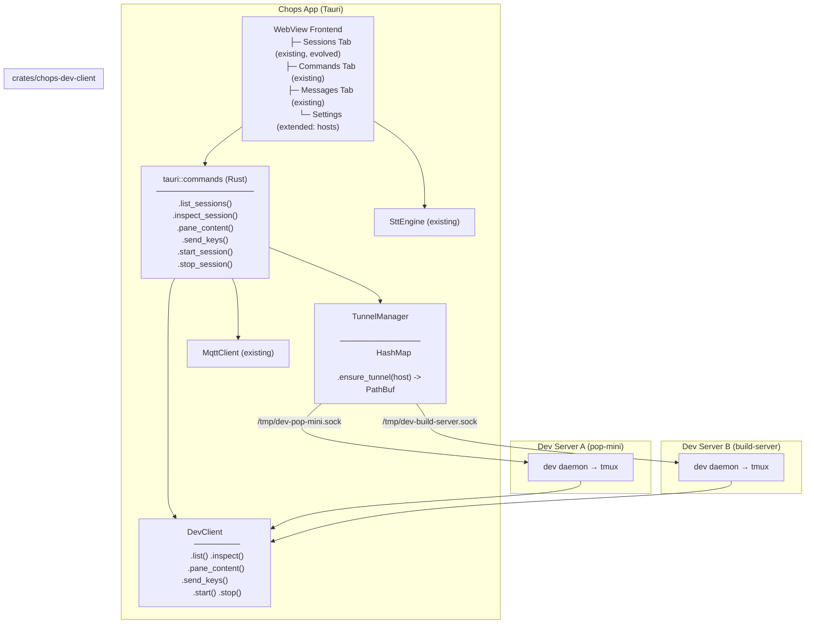
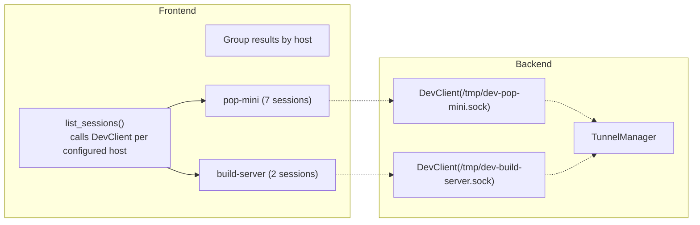
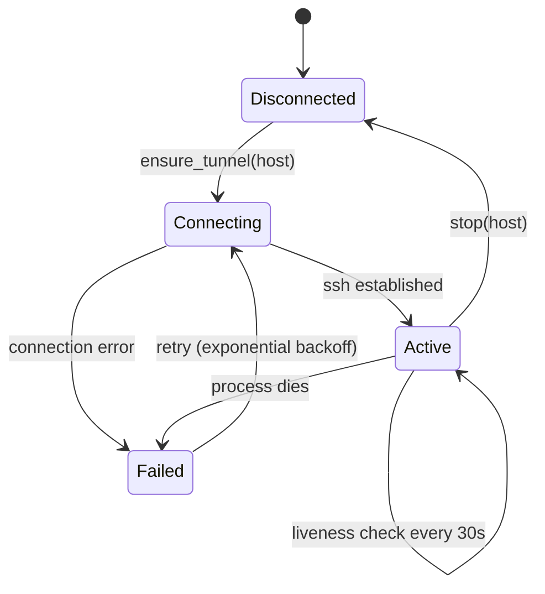
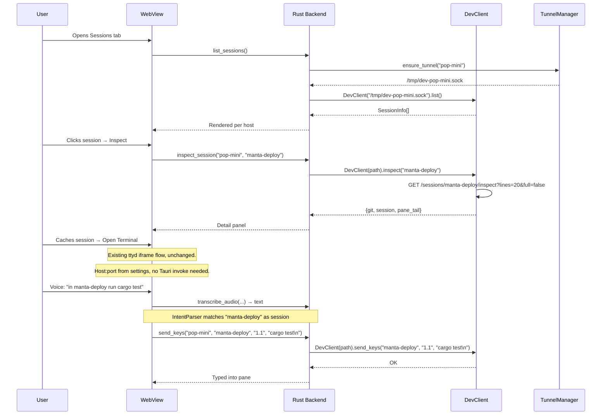

# chops — Session Manager Evolution

> Adapting the existing chops Tauri app to natively manage `dev` CLI sessions.
> Chops already has a Sessions tab with ttyd terminal, MQTT-based voice control,
> and an intent parser that routes "in \<project\> do \<command\>" voice patterns.
> We extend it to talk directly to the `dev` daemon (bypassing MQTT for session ops),
> support multiple remote hosts via SSH tunnels, and add an inspect/details panel.

## 1. Goals

- Wire the existing Sessions tab directly to the `dev` daemon via `chops-dev-client`
  (currently it proxies through ttyd + the web-ui HTTP API)
- Support multiple remote dev servers via per-host SSH tunnels
- Add an Inspect panel showing git state, pane tail, and session metadata
- Route voice commands that match session patterns directly to `DevClient.send_keys()`
  instead of through MQTT → agent-core
- Keep existing chops features (voice, MQTT, commands, messages) — both paths coexist
- Cross-platform: macOS (aarch64), Linux (x86_64), Android (aarch64)

### Explicitly out of scope

- Replacing ttyd with xterm.js — ttyd is what ships. xterm.js would need a PTY backend
  (~4-6h extra, not justified until ttyd proves insufficient)
- Abstracted terminal viewer interface — revisit if/when ttyd is replaced

## 2. Prerequisites (dev codebase changes)

`DevClient` has `list()`, `send_keys()`, `start()`, `stop()` but is missing two methods
the chops UI needs. These must be added to `crates/chops-dev-client` (which mirrors the
daemon API at `dev-lib/src/daemon.rs`):

| Method | Daemon endpoint | Purpose |
|---|---|---|
| `inspect(name) -> Result<Value>` | `GET /sessions/{name}/inspect?lines=N&full=B` | Git state + pane tail |
| `pane_content(name, pane, lines) -> Result<String>` | `GET /sessions/{name}/panes/{pane}/content?lines=N` | Raw pane text for detail panel |

These exist in `dev daemon` but are not wrapped in `chops-dev-client`. Implementation
follows `send_keys()` — one async fn per endpoint, raw HTTP/1.1 over Unix socket.

## 3. Architecture



### Current vs proposed data flow

| Action | Current path | Proposed path |
|---|---|---|
| List sessions | HTTP GET → web-ui → DevClient | Tauri invoke → DevClient |
| Open terminal | HTTP POST switch → ttyd | Tauri invoke → DevClient |
| Send keys | same ttyd iframe | Tauri invoke → DevClient |
| Inspect session | unavailable | Tauri invoke → DevClient |
| Voice session cmd | MQTT → agent-core → plugin-runner | IntentParser → Tauri invoke → DevClient |
| Voice non-session cmd | MQTT → agent-core (unchanged) | same |

## 4. Unified Action Dispatch

Both UI clicks and voice commands route through a common dispatch layer:

```typescript
// app/src/js/session/SessionAction.js

export type SessionAction =
  | { type: "send_keys";      host: string; session: string; keys: string }
  | { type: "start";          host: string; project: string; layout?: string }
  | { type: "stop";           host: string; session: string }
  | { type: "inspect";        host: string; session: string }
  | { type: "pane_content";   host: string; session: string; pane: string; lines: number }
  | { type: "list_sessions" };

export async function dispatch(action: SessionAction): Promise<any> {
  const { invoke } = window.__TAURI_INTERNALS__;
  switch (action.type) {
    case "send_keys":
      return invoke("send_keys", { host: action.host, session: action.session, keys: action.keys });
    // ...
  }
}
```

Voice → IntentParser → if session command, `dispatch()` directly instead of MQTT.
This makes session ops faster (no MQTT round-trip) and the terminal view stays in sync.

## 5. Multi-host session list



## 6. SSH Tunnel lifecycle



```rust
// app/src-tauri/src/tunnel.rs

pub struct TunnelManager {
    tunnels: HashMap<String, SshTunnel>,
}

impl TunnelManager {
    pub fn ensure_tunnel(&mut self, host: &str) -> Result<&Path>;
    pub fn stop(&mut self, host: &str);
    pub fn stop_all(&mut self);
}

struct SshTunnel {
    host: String,
    child: Option<Child>,
    socket_path: PathBuf,
}

impl Drop for SshTunnel {
    fn drop(&mut self) {
        if let Some(mut child) = self.child.take() {
            let _ = child.kill();
        }
    }
}
```

## 7. AppState (Tauri backend)

```rust
// app/src-tauri/src/lib.rs

pub struct AppState {
    pub tunnel_mgr: Mutex<TunnelManager>,
    pub mqtt: Arc<MqttClient>,      // existing
    pub stt: Arc<SttEngine>,        // existing
}
```

New Tauri commands (added alongside existing MQTT/STT commands):

| Command | Signature | Description |
|---|---|---|
| `list_sessions` | `() -> Result<Vec<HostSessions>>` | All hosts → grouped sessions |
| `inspect_session` | `(host, name) -> Result<Value>` | Git state + pane tail |
| `pane_content` | `(host, name, pane, lines) -> Result<String>` | Raw pane text |
| `send_keys` | `(host, name, pane, keys) -> Result<()>` | Type into pane |
| `start_session` | `(host, project, layout?) -> Result<()>` | Create session |
| `stop_session` | `(host, name) -> Result<()>` | Kill session |
| `tunnel_status` | `() -> Result<Vec<TunnelStatus>>` | Per-host tunnel health |
| `add_host` | `(hostname) -> Result<()>` | Add to host list |
| `remove_host` | `(hostname) -> Result<()>` | Remove from host list |
| `list_hosts` | `() -> Result<Vec<String>>` | Configured hosts |

New dependency: add `chops-dev-client` to `app/src-tauri/Cargo.toml`:

```toml
chops-dev-client = { path = "../../crates/chops-dev-client" }
```

No other new Rust deps — SSH tunnel uses `std::process::Command`, serialization uses `serde_json` (already present).

## 8. Data flow



## 9. New files

| File | Lines | Purpose |
|---|---|---|
| `app/src-tauri/src/tunnel.rs` | ~100 | `TunnelManager` — per-host SSH tunnel lifecycle |
| `app/src/js/session/SessionAction.js` | ~50 | Action dispatcher — routes to DevClient or MQTT |
| `app/src/js/session/sessions.js` | ~250 | Host-grouped session list, inspect panel, actions |

## 10. Modified files

| File | Changes |
|---|---|
| `app/src-tauri/Cargo.toml` | Add `chops-dev-client` dep |
| `app/src-tauri/src/lib.rs` | Add `TunnelManager` to `AppState`, register 10 new commands |
| `app/src-tauri/tauri.conf.json` | Bump window size for detail panel |
| `app/src/index.html` | Add inspect panel markup, host settings fields |
| `app/src/js/app.js` | Register session polling, host management, wire SessionAction |
| `app/src/js/terminal.js` | Refactor `sendKeysToTerminal` to use `SessionAction` not HTTP |
| `app/src/styles.css` | Inspect panel, host-grouped list, tunnel status bar |
| `crates/chops-dev-client/src/lib.rs` | Add `inspect()` + `pane_content()` methods |

## 11. UI Layout

```
┌─ chops ───────────────────────────────────────────────────────┐
│  [Sessions] [Commands] [Messages] [Debug]                     │
├──────────────────────────────────────────────────────────────┤
│  Hosts: [pop-mini ▼] [+ Add]                                 │
│                                                               │
│  ┌── pop-mini ──────────────────────────────────────────┐    │
│  │ SESSION     STATE   LAST      BRANCH            ●  ⚡│    │
│  │ ● dev       active  2m ago    main              ●  │    │
│  │ ● manta-dep active  30m ago   fix/rollout       ○  │    │
│  │ ○ manta-com idle    1h ago    feat/swarm        ○  │    │
│  │ [Inspect] [Terminal] [Kill] [⟳ 5s]               │    │
│  └─────────────────────────────────────────────────────┘    │
│                                                               │
│  ┌── build-server ───────────────────────────────────────┐    │
│  │ ● api       active  5m ago    main              ●  │    │
│  │ ○ worker    idle    1h ago    feat/queue        ○  │    │
│  └─────────────────────────────────────────────────────┘    │
│                                                               │
│  Tunnels: pop-mini ● | build-server ● | 9 sessions           │
├──────────────────────────────────────────────────────────────┤
│ ┌─ manta-deploy — inspect ────────────────────────────────┐  │
│ │ Git:     fix/rollout (a1b2c3d)     ○                     │  │
│ │ Last:    30m ago                                          │  │
│ │ Repo:    github.com/mantatech/manta-deploy                │  │
│ │                                                            │  │
│ │ Pane tail:                                                 │  │
│ │ ┌──────────────────────────────────────────────────────┐  │  │
│ │ │ $ cargo test                                         │  │  │
│ │ │    Compiling manta-deploy v0.1.0                     │  │  │
│ │ │    test result: ok. 42 passed                        │  │  │
│ │ └──────────────────────────────────────────────────────┘  │  │
│ │ [Open Terminal via ttyd] [⟳ Refresh]                      │  │
│ └──────────────────────────────────────────────────────────┘  │
└───────────────────────────────────────────────────────────────┘
```

## 12. Cross-platform targets

| Platform | Tauri target | Status |
|---|---|---|
| macOS (Apple Silicon) | `aarch64-apple-darwin` | ✅ (current CI) |
| Linux (x86_64) | `x86_64-unknown-linux-gnu` | ✅ (current CI) |
| Android (aarch64) | `aarch64-linux-android` | ✅ (existing chops target) |
| macOS (Intel) | `x86_64-apple-darwin` | ❌ not in CI, add on demand |
| Linux (ARM) | `aarch64-unknown-linux-gnu` | ❌ not in CI, add on demand |

Android: SSH tunnel uses Termux's `ssh` binary. `tunnel.rs` detects Android via
`target_os = "android"` and defaults to `/data/data/com.termux/files/usr/bin/ssh`.

## 13. Milestones

| Step | Description | Est. |
|---|---|---|
| 1 | Add `inspect()` + `pane_content()` to `chops-dev-client` | 1h |
| 2 | Add `chops-dev-client` dep to `app/src-tauri/Cargo.toml`, wire into `AppState` | 0.5h |
| 3 | Write `tunnel.rs` — `TunnelManager` with per-host lifecycle | 1h |
| 4 | Add 10 Tauri commands to `lib.rs` — list/inspect/pane/send/start/stop + host mgmt | 2h |
| 5 | Write `SessionAction.js` — action dispatcher | 0.5h |
| 6 | Write `sessions.js` — host-grouped session list, inspect panel, polling | 2.5h |
| 7 | Update HTML — inspect panel markup, host setting fields in settings modal | 0.5h |
| 8 | Refactor `terminal.js` to use `SessionAction` instead of HTTP calls | 1h |
| 9 | IntentParser integration — route session voice commands via `SessionAction` | 1h |
| 10 | Android — detect Termux SSH path in `tunnel.rs` | 0.5h |
| **Total** | | **10h** |
